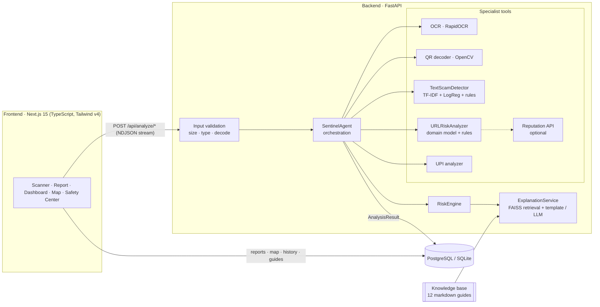
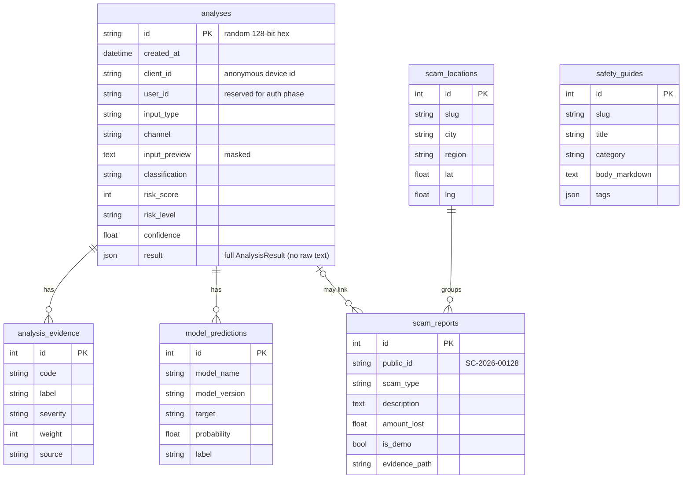

# SENTINEL — Architecture

## 1. System overview



The **frontend** never talks to ML code directly. Everything goes through the
REST API, so any client (browser extension, mobile app) could reuse it later.

## 2. Analysis flow

```
User input
  └─► Input validation            (app/core/security.py, app/ml/url/parsing.py)
       └─► Input type identification (API endpoint → InputType)
            └─► SentinelAgent      (app/agents/orchestrator.py)
                 ├─ routes artifacts to specialist tools
                 ├─ tools may produce NEW artifacts (OCR text, QR payload, URLs)
                 └─ collects Evidence + ModelOutputs into ComponentScores
                      └─► RiskEngine          (app/risk/engine.py)
                           └─► ExplanationService (app/rag/explainer.py)
                                └─► AnalysisResult → persisted → UI
```

### Agent routing table

| Artifact | Tools (in order) | Can produce |
|---|---|---|
| `image` (screenshot) | `qr_scanner`, `ocr_reader` | `upi`, `url`, `text` |
| `qr_image` | `qr_decoder` | `upi`, `url`, `text`, `qr_other` |
| `text` | `text_classifier`, `url_extractor` | `url` |
| `url` | `url_analyzer` (+ reputation if configured) | — |
| `upi` | `upi_analyzer` | — |
| `qr_other` (Wi-Fi etc.) | `qr_payload_describer` | — |

Example — a screenshot of a WhatsApp message containing a link:

```
input_router → qr_scanner (none found) → ocr_reader → text_classifier
            → url_extractor → url_analyzer → risk_engine → explanation_service
```

Every tool call becomes an `AgentStep {tool, stage, status, duration_ms, note}`.
Steps are streamed to the browser as they finish (NDJSON), which drives the
progress console, and are stored in the result's `trace`.

### Why a deterministic agent?

The agent is a **coordinator, not a classifier**. Its routing is a fixed table so
that the same input always produces the same verdict and every decision can be
explained. An LLM planner could replace the routing table later without changing
any tool; see `docs/decisions.md` (ADR-002).

## 3. Components

| Layer | Module | Responsibility |
|---|---|---|
| API | `app/api/analyze.py` | analyze endpoints, NDJSON streaming, persistence |
| | `app/api/history.py` | stored report, per-device history & stats |
| | `app/api/community.py` | reports, scam map, safety guides |
| | `app/api/health.py` | capability status (what's live / unavailable) |
| Core | `app/core/config.py` | env-driven settings (all optional) |
| | `app/core/security.py` | upload caps, magic-byte + decode validation, text cleaning, log redaction |
| | `app/core/errors.py` | friendly error model; no stack traces to clients |
| | `app/core/ratelimit.py` | sliding-window rate limiting |
| Agent | `app/agents/orchestrator.py` | routing, evidence collection, trace |
| ML | `app/ml/text/*` | preprocessing, indicator rules, TF-IDF+LR model, training |
| | `app/ml/url/*` | safe parsing, lexicon, domain model, rules, training |
| Services | `app/services/ocr.py` | RapidOCR + OCR artefact repair |
| | `app/services/qr.py` | OpenCV QR decoding with pre-processing variants |
| | `app/services/upi.py` | UPI payment-intent parsing & evidence |
| | `app/services/reputation.py` | optional Google Safe Browsing |
| | `app/services/audio.py` | Phase-2 interfaces; reports "unavailable" |
| Risk | `app/risk/engine.py` | scoring formula, bands, classification |
| | `app/risk/recommendations.py` | evidence → actions |
| RAG | `app/rag/knowledge.py` | markdown KB loader & chunker |
| | `app/rag/index.py` | LSA embeddings, FAISS index, tag re-ranking |
| | `app/rag/explainer.py` | grounded explanation (template or LLM) |
| | `app/rag/llm.py` | optional Claude provider, schema-validated |

## 4. Data model



Migrations: Alembic (`backend/alembic/`), applied automatically at startup.
Works on SQLite (default local) and PostgreSQL (docker-compose).

## 5. Privacy & security design

* **No account required.** A random UUID in `localStorage` (`X-Sentinel-Client`
  header) groups a device's history. It is not linked to identity.
* **Minimal retention.** Raw message text and uploaded images are never stored.
  Analyses keep a 160-char preview with digit runs ≥ 6 masked.
* **Links are never fetched.** URL analysis is lexical; the optional reputation
  lookup sends the URL string to Google Safe Browsing, not to the site.
* **Uploads**: size-capped while reading (not trusting `Content-Length`),
  magic-byte check, full Pillow decode, decompression-bomb limit, never written
  under a user-supplied name. Report evidence is re-encoded to PNG (strips EXIF /
  GPS) and stored outside any served directory.
* **Scam map** exposes only city-level aggregates; descriptions, evidence and
  amounts are never returned by any public endpoint.
* **Errors**: a single handler converts every exception into
  `{error: {code, message, hint}}`; stack traces are logged server-side only,
  and logs never contain full user content.
* **Rate limiting** on analyze and report endpoints; CORS restricted to
  configured origins; security headers (`nosniff`, `DENY`, `no-referrer`).

## 6. Frontend structure

```
frontend/
├── app/
│   ├── (site)/            landing page (header + footer layout)
│   └── (app)/             app shell with sidebar
│       ├── dashboard/ analyze/ analysis/[id]/ history/
│       ├── map/ report/ safety/ safety/[slug]/ settings/
├── features/              scanner, analysis report, community (map, report form)
├── components/            ui primitives (shadcn-style), layout, brand, risk
├── hooks/use-analysis-run.ts   NDJSON stream consumer + paced stage reveal
├── lib/                   api client, risk vocabulary, device id, utils
└── types/api.ts           mirrors backend schemas
```

## 7. Extension points (future phases)

| Capability | Where it plugs in |
|---|---|
| Transformer text model | implement `TextScamDetector.predict()`; swap in `get_text_detector()` |
| Speech-to-text / deepfake | implement `SpeechToText` / `VoiceAuthenticityAnalyzer`; add an `audio` route to the agent |
| Authentication | `analyses.user_id` column exists; add an auth dependency and a users table migration |
| Neural embeddings | implement the `Embedder` protocol in `app/rag/index.py` |
| Official reporting integration | extend `create_report` with an outbound adapter |
